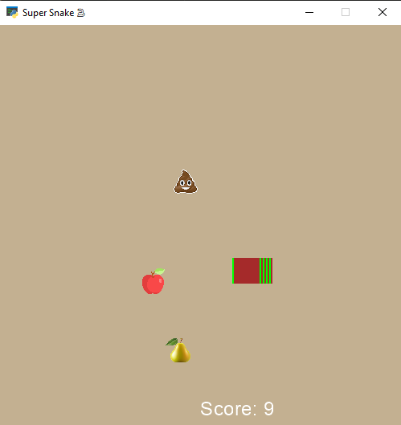

# Assignment-15
---
## files description

| File name | Description |
|--- | --- |
|super_snake.py | Old Snake Game |

By eating each of the objects in the window, the length of the snake's body will increase and the player's score will change as follows:
1. Pear: 2 points
2. Apple: 1 point
3. Poop: -1 point

Game over modes:
1. Snake get out of the window
2. The player's score becomes zero

