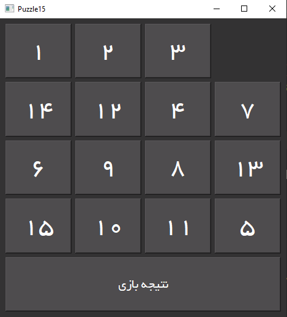
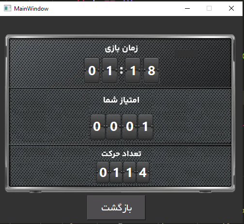
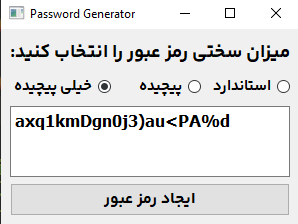
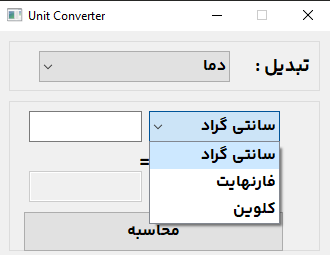
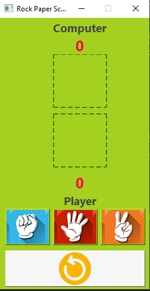
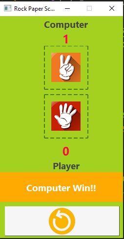

# Assignment-19
---
## Puzzle 15 Game
### Puzzle 15 is a classic sliding puzzle game where the player must rearrange the tiles in numerical order by sliding them into the empty space. The game consists of a 4x4 grid with numbered tiles, and the objective is to arrange the tiles in ascending order from 1 to 15, with the empty space in the bottom right corner.

---

## Password Generator Application
### A password generator application is a tool that creates strong and secure passwords for users to use for their online accounts. The application uses a combination of letters, numbers, and special characters to generate complex passwords that are difficult for hackers to guess or crack. Users can customize the length and complexity of the passwords generated, and the application can also save and store the passwords for easy access. This type of application is essential for maintaining online security and protecting sensitive information from unauthorized access.

---

## Guess Number Game
### The guess number game is a classic game where one player thinks of a number within a certain range, and the other player has to guess what that number is. The guessing player typically starts by making a guess, and the number provider responds with whether the guess is too high, too low, or correct.

--- 
 
## Unit Converter Application
### You can use the unit converter to convert from one measurement to another. For example, you could convert from Celsius to Fahrenheit.

 
---

## Rock Paper Scissors Game
### Rock Paper Scissors is a simple hand game usually played between two people. The game has three possible outcomes: a player who decides to play rock will beat another player who has chosen scissors, but will lose to one who has played paper; a play of paper will lose to a play of scissors. If both players choose the same shape, the game is tied and is usually immediately replayed to break the tie.

