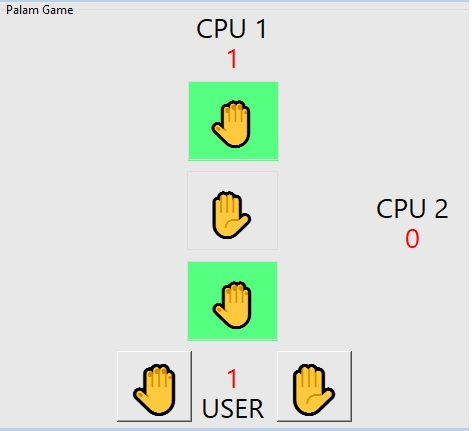
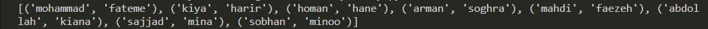
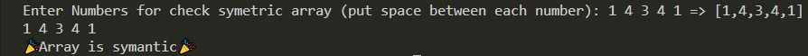
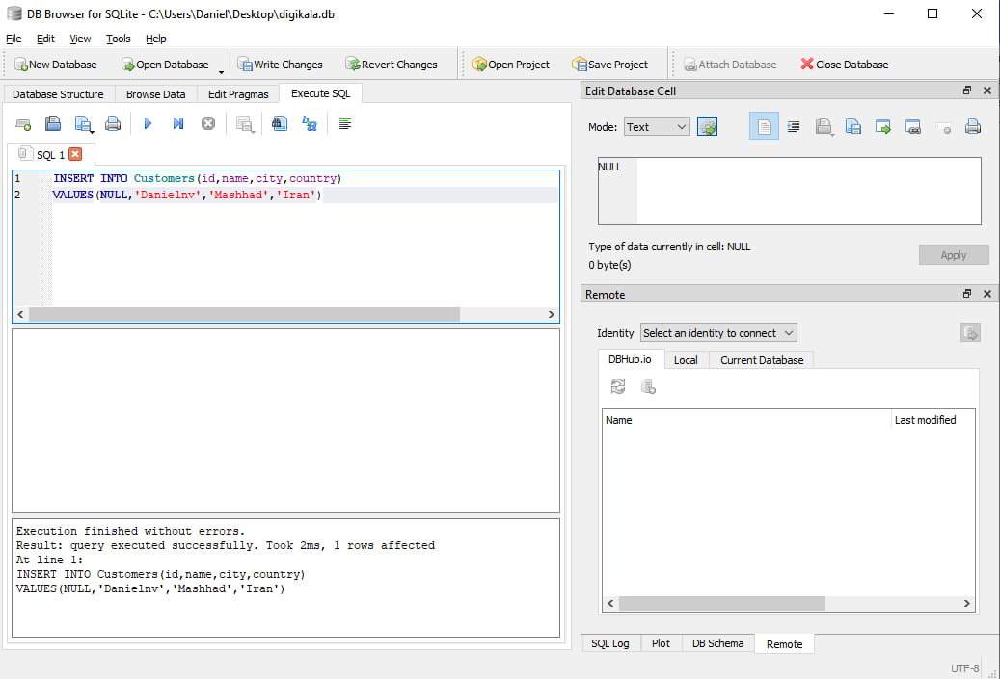
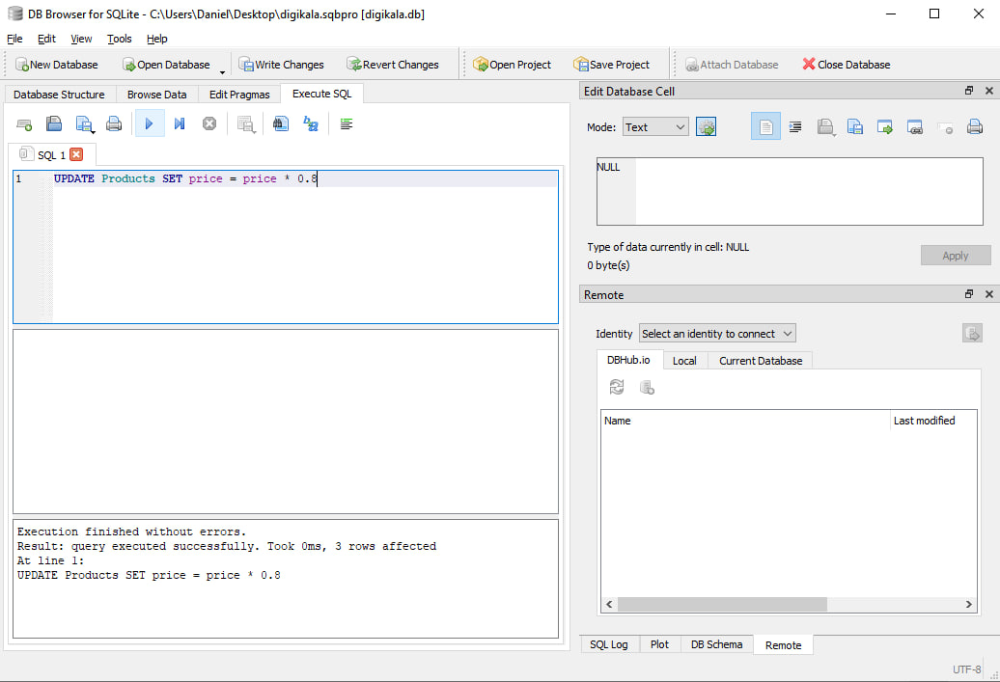
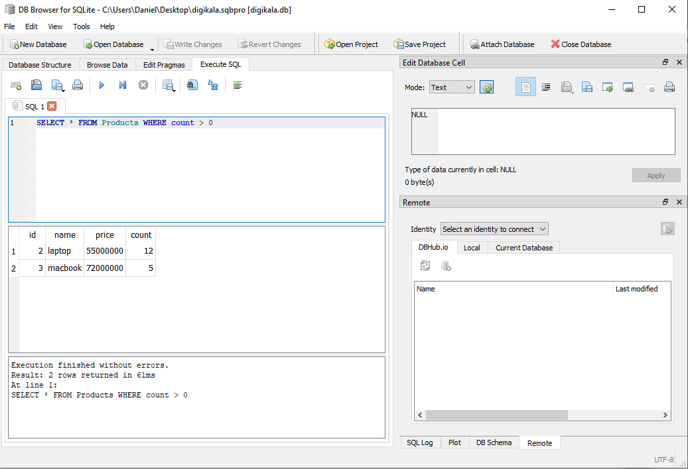
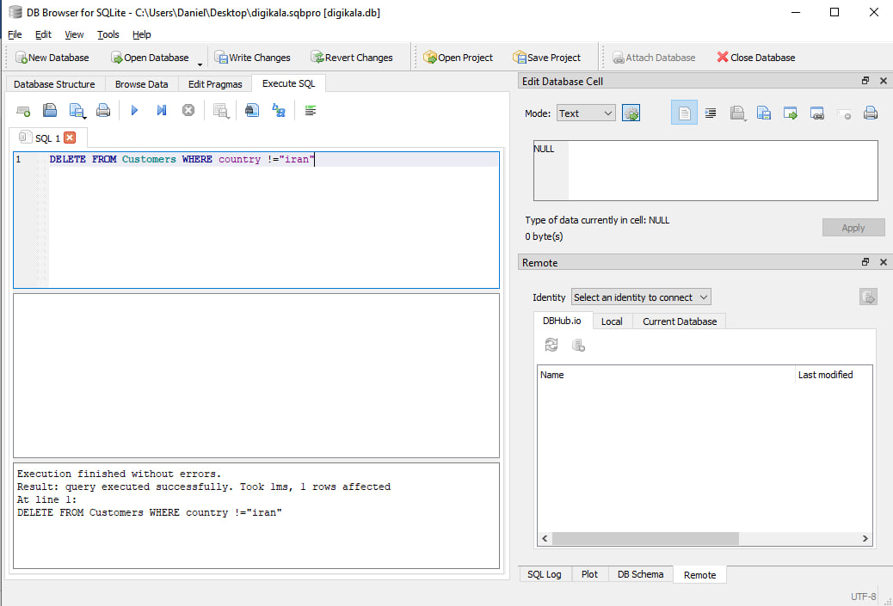

# Assignment-20
---
## Game
### palam polum pilish is one of the old game with minimum three person and each person takes sign opposite of other he is lose

---
## Marry
### This program match each boy to a girl and print a marriage list

---
## Symetric array
### This program control array and print this array is symetric or not

---
## DB practice
### In this practice i made a database using SQLite for a wwebsite like digikala and use 4 main operators (Create Read Update Delete) by sql orders

