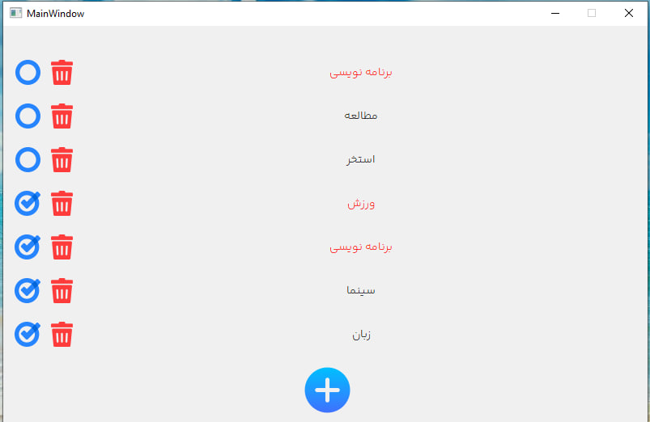
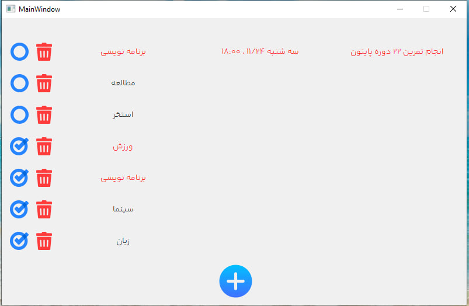
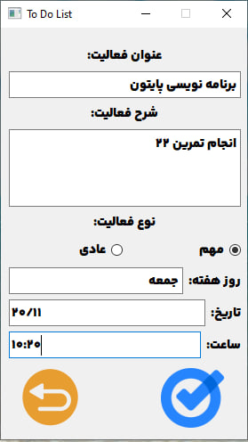

# Assignment-22
---
## To Do List
> [!NOTE]
This is a application like microsoft todo or Google task that people write works list and sign important or normal job

> [!IMPORTANT]  
this program was exported by pyinstaller and easy to use by executing EXE file. open Dist DIR and execute "main.exe"

### Home screen

---
### Task details by click on each title

---
### Add new task page

