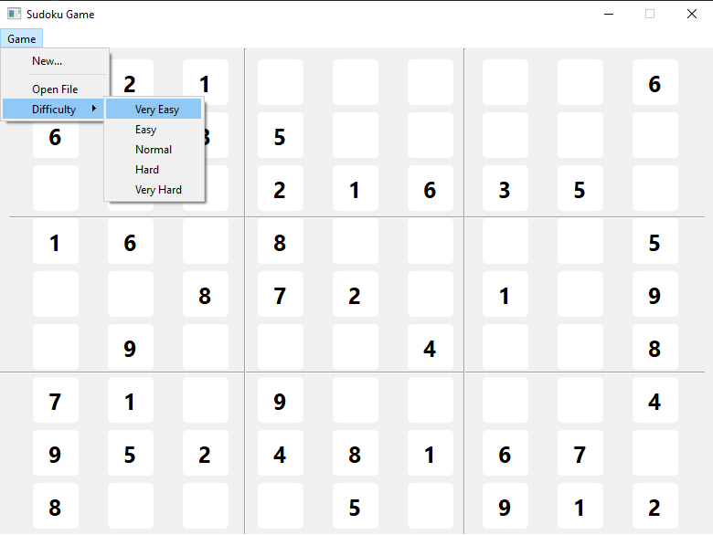
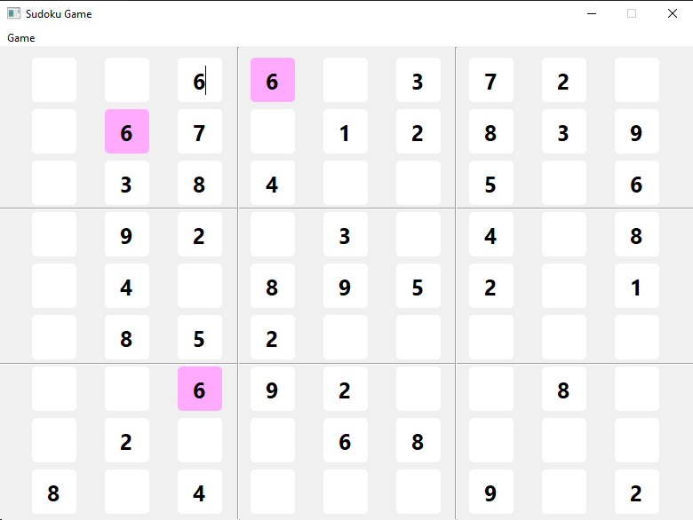
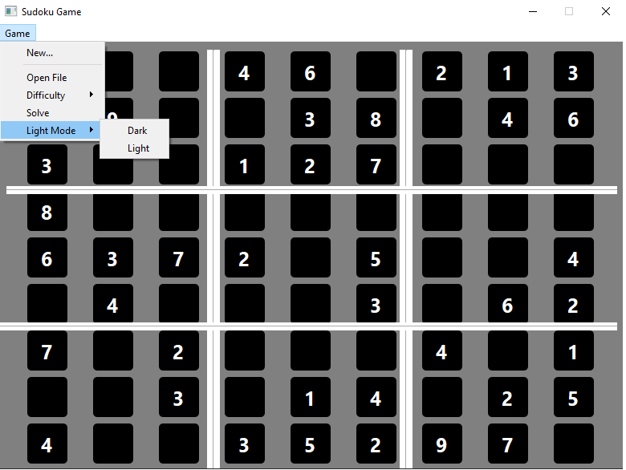
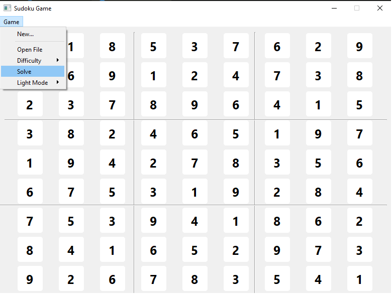

# Assignment-23

---

## SUDOKU

> [!NOTE]
> This is a simple SUDOKU game writtern by sudoku library and has four difficulty level: Very Easy(0.1), Easy(0.3), Normal(0.5), Hard(0.7) and Very Hard (0.9).

## Some options such as:
### Dark & Light mode
### Solve button
### Open your favorite sudoku text file in this game(table with space seprated) 

> [!IMPORTANT]  
> If you enjoy it, Please give star to me.

## Sudoku game and difficulty levels

### 

## Sudoku screen

### 

## Sudoku screen mode

### 

### Sudoku solve option

## 
