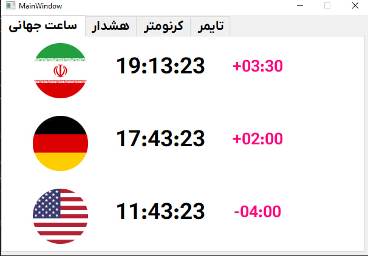
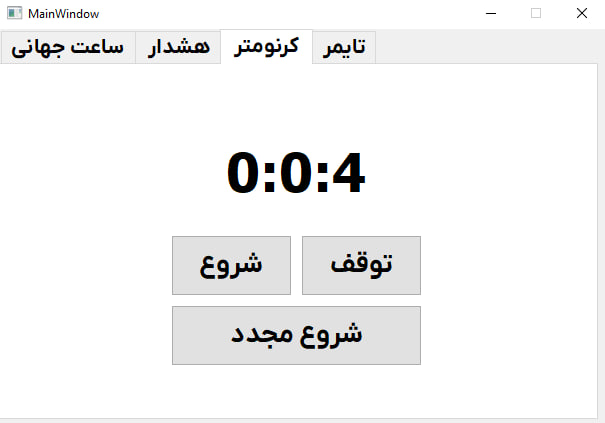

# Assignment-25

## Installation

> [!NOTE]
> Use setup.exe in setup folder to easy install  

## Global Time

> [!NOTE]
> Show official clock of IRAN , GERMANY & US with their time zones calculate by UTC.

### 

## StopWatch

> [!NOTE]
> A stopwatch is a timepiece designed to measure the amount of time that elapses between its activation and deactivation. A large digital version of a stopwatch designed for viewing at a distance, as in a sports stadium, is called a stop clock

### 

## Timer

> [!NOTE]
> 

### 

