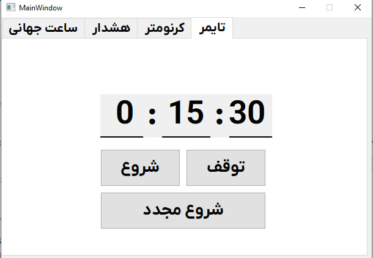

# Assignment-25

## Installation

> [!NOTE]
> Use setup.exe in setup folder to easy install  


## Global Time

> [!NOTE]
> Show official clock of **IRAN** , **GERMANY** & **US** with their time zones calculate by UTC.
```
    self.local_time = datetime.datetime.now(datetime.timezone.utc)
    self.fmt = "%H:%M:%S"
    self.zone = "%z"
    self.ir = timezone("Asia/Tehran")
    self.us = timezone("US/Eastern")
    self.de = timezone("Europe/Berlin")
```

### 

## StopWatch

> [!NOTE]
> A stopwatch is a timepiece designed to measure the amount of time that elapses between its activation and deactivation. A large digital version of a stopwatch designed for viewing at a distance, as in a sports stadium, is called a stop clock

### 

## Timer

> [!NOTE]
> Use timer and see remain time and then show notification

### 

