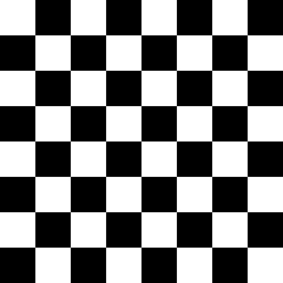
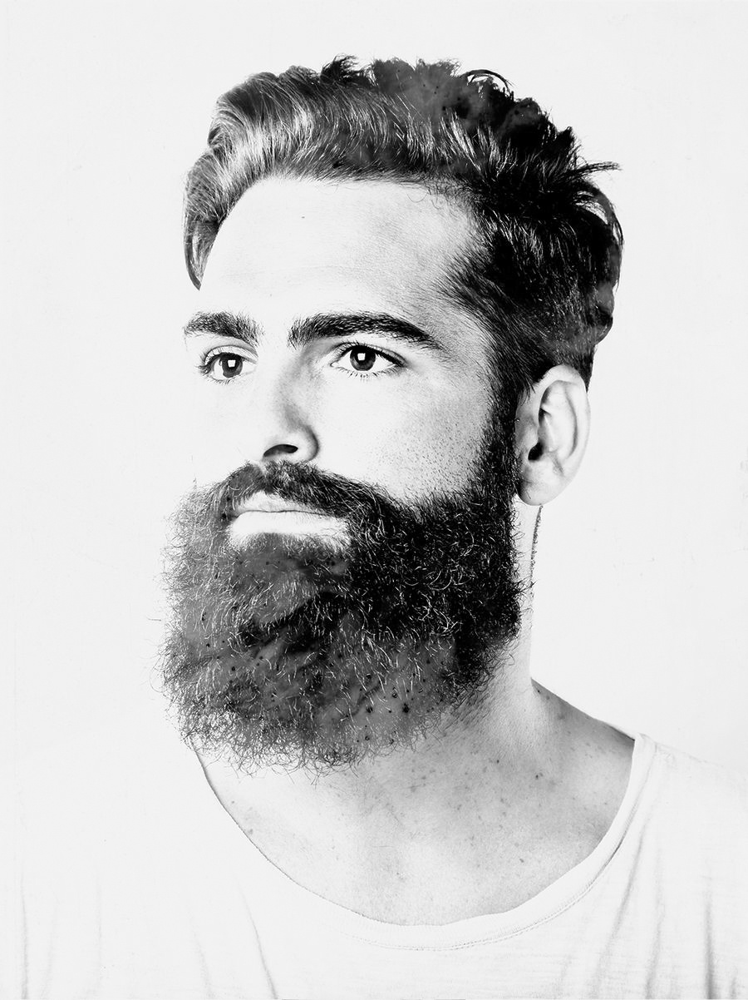
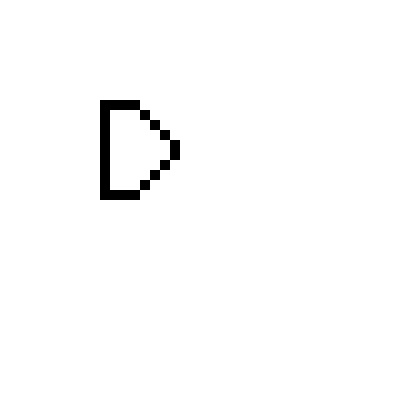

# Assignment-26

## Introduction
> This tutorial is about getting started with the cv2 image processing library in Python

> [!NOTE]
> Chess_board.py : make chess board with cv2 library  
### 

> [!NOTE]
> Black_tape.py : placing a black tape on the left side of the profile picture
### 

> [!NOTE]
> Gradient.py : create a color gradient from white to black with the cv2 library
### 

> [!NOTE]
> Invert_color.py : invert the white and black colors of the image
### 
### 

> [!NOTE]
> Name.py : writing the first letter of the first name with the Cv2 library
### 

> [!NOTE]
> Rotate.py : rotate image 180 degrees with cv2 library
### 

