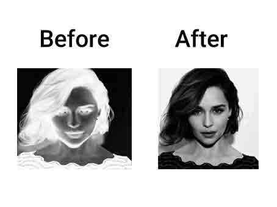
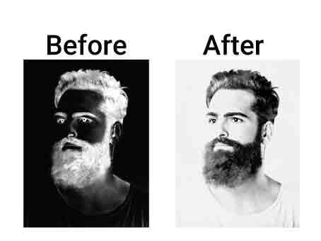
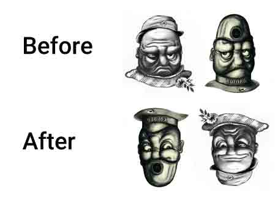

# Assignment-26

## Introduction
> This tutorial is about getting started with the cv2 image processing library in Python

> [!NOTE]
> Chess_board.py : make chess board with cv2 library  
### 
```
for i in range(0, 8):
    for j in range(0, 8):
        if i % 2 == 0 and j % 2 != 0:
            color = 0

        elif i % 2 != 0 and j % 2 == 0:
            color = 0

        else:
            color = 255
```


> [!NOTE]
> Black_tape.py : placing a black tape on the left side of the profile picture
### 
```
for i in range(70):
    if start_width_black_tap >= 0:
        end_black_tap = start_width_black_tap + black_tap_length
        profile_cvt[i : i + 1, start_width_black_tap:end_black_tap] = 0
        start_width_black_tap -= 1
    else:
        profile_cvt[i : i + 1, 0:black_tap_length] = 0
        black_tap_length -= 1
```


> [!NOTE]
> Gradient.py : create a color gradient from white to black with the cv2 library
### 
```
for i in range(255):
    bg_cvt[i : i + 1, 0:255] = abs(i - 255)
```


> [!NOTE]
> Invert_color.py : invert the white and black colors of the image
### 
### 
```
image1_neg = cv2.bitwise_not(image1_cvt)
image2_neg = cv2.bitwise_not(image2_cvt)
```


> [!NOTE]
> Name.py : writing the first letter of the first name with the Cv2 library
### 
```
bg_cvt[100:200, 100:110] = 0
bg_cvt[100:110, 110:140] = 0
bg_cvt[110:120, 140:150] = 0
bg_cvt[120:130, 150:160] = 0
bg_cvt[130:140, 160:170] = 0
bg_cvt[140:150, 170:180] = 0
bg_cvt[150:160, 170:180] = 0
bg_cvt[160:170, 160:170] = 0
bg_cvt[170:180, 150:160] = 0
bg_cvt[180:190, 140:150] = 0
bg_cvt[190:200, 100:140] = 0
```


> [!NOTE]
> Rotate.py : rotate image 180 degrees with cv2 library
### 
```
image3 = cv2.imread("images/3.jpg")
image3_rotate = cv2.rotate(image3, cv2.ROTATE_180)
```

