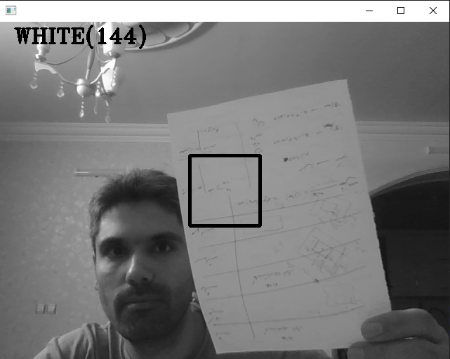
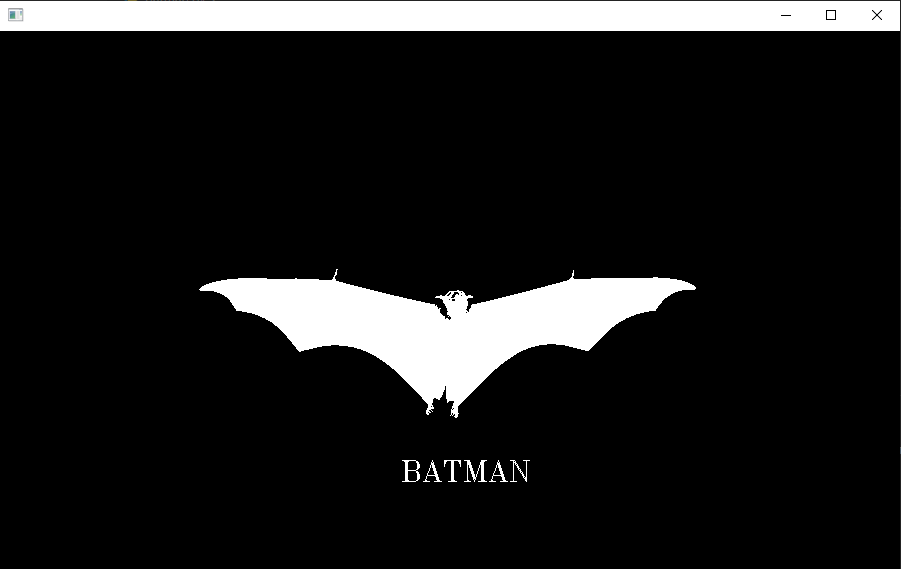
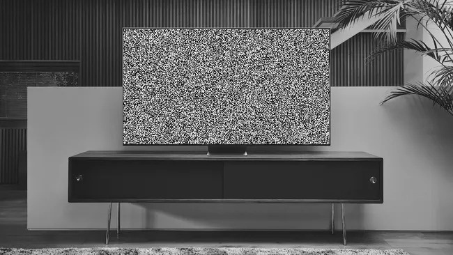

# Assignment-27

> [!TIP]
> This tutorial is about image,color and video proccessing

## Detector.py :

> Design a color detector with cv2 library using webcam

### 

```
Black = RGB color < 100
Gray = RGB color >= 100 and <= 150
White = RGB color > 150
```

## Snowfall.py :

> Design a winter landscape with snowfall

### 


## Battman.py :

> Design a battman logo type

### 


## TV.py :

> Design a tv noise screen

### 


```
image1_neg = cv2.bitwise_not(image1_cvt)
image2_neg = cv2.bitwise_not(image2_cvt)
```

## Name.py :

> writing the first letter of the first name with the Cv2 library

### 

```
bg_cvt[100:200, 100:110] = 0
bg_cvt[100:110, 110:140] = 0
bg_cvt[110:120, 140:150] = 0
bg_cvt[120:130, 150:160] = 0
bg_cvt[130:140, 160:170] = 0
bg_cvt[140:150, 170:180] = 0
bg_cvt[150:160, 170:180] = 0
bg_cvt[160:170, 160:170] = 0
bg_cvt[170:180, 150:160] = 0
bg_cvt[180:190, 140:150] = 0
bg_cvt[190:200, 100:140] = 0
```

## Rotate.py :

> rotate image 180 degrees with cv2 library

### 

```
image3 = cv2.imread("images/3.jpg")
image3_rotate = cv2.rotate(image3, cv2.ROTATE_180)
```
