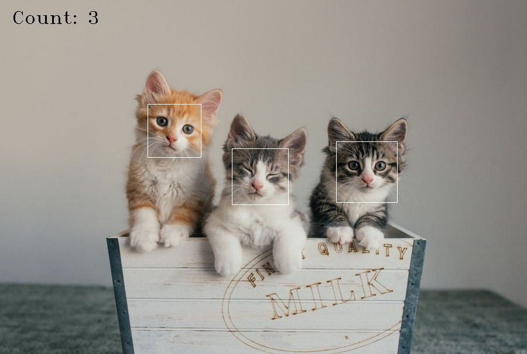
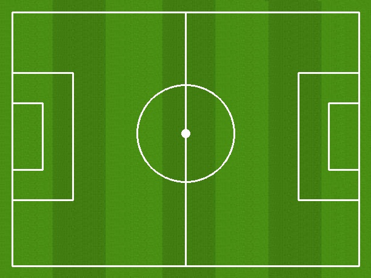
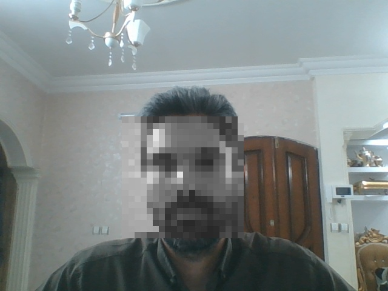
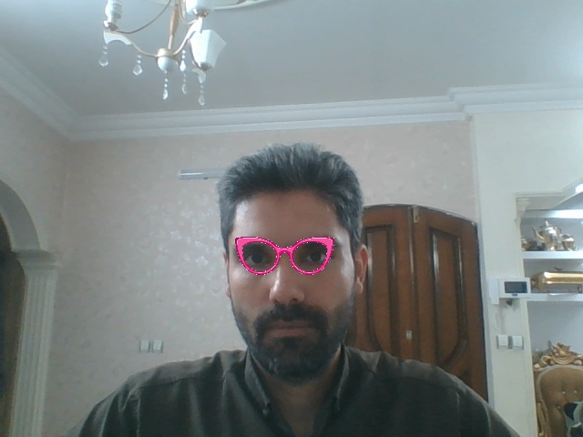
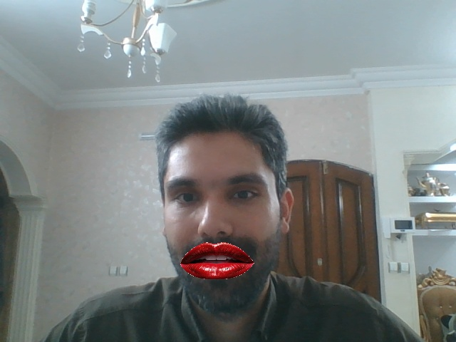
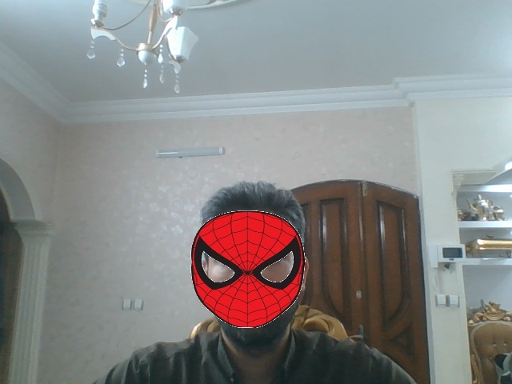
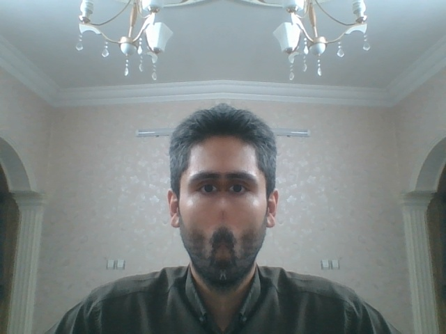

# Assignment-28
This Assignment is about face detection with opencv python

## How to install 
Run following command
```
pip install -r requirements.txt
```

## How to run
> [!IMPORTANT]

Inside each folder execute this command in terminal 
```
python main.py
```

## Result
> ### Cat face detection


>> Cascade Classifier for cat face detection
```
cat_face_detector = cv2.CascadeClassifier(cv2.data.haarcascades + "haarcascade_frontalcatface.xml")
```

> ### Draw football pitch

>> Codes for drawing the white lines of the football pitch
```
cv2.rectangle(football_pitch, [20, 20], [592, 439], [255, 255, 255], 2)
cv2.line(football_pitch, [306, 20], [306, 439], [255, 255, 255], 2)
cv2.rectangle(football_pitch, [20, 120], [120, 330], [255, 255, 255], 2)
cv2.rectangle(football_pitch, [20, 170], [70, 280], [255, 255, 255], 2)
cv2.rectangle(football_pitch, [492, 120], [592, 330], [255, 255, 255], 2)
cv2.rectangle(football_pitch, [542, 170], [592, 280], [255, 255, 255], 2)

```

> ### Face filter
>> #### Chess mask

```
small_pixel_square = cv2.resize(frame_gray[y : y + h, x : x + w], [20, 20])
large_pixel_square = cv2.resize(
small_pixel_square, [w, h], interpolation=cv2.INTER_NEAREST
)

face_image_big_bgr = cv2.cvtColor(large_pixel_square, cv2.COLOR_GRAY2BGR)
frame[y : y + h, x : x + w] = face_image_big_bgr
```

>> #### Eye mask

```
eye_detector = cv2.CascadeClassifier(cv2.data.haarcascades + "haarcascade_eye.xml")

eyes = eye_detector.detectMultiScale(
    frame_gray[y : y + h, x : x + w], scaleFactor=1.1, minNeighbors=5
)
```

>> #### Lip mask

>>> Cascade Classifier
```
smiles = lip_detector.detectMultiScale(
    frame_gray[y : y + h, x : x + w],
    scaleFactor=1.7,
    minNeighbors=22,
    minSize=(25, 25),
)
```

>> ### Face Mask

>>> Cascade Classifier
```
faces=face_detector.detectMultiScale(frame_gray, scaleFactor=1.3)
```

>> ### Mirror mask

>>> Codes for this filter
```
center_x = frame.shape[1] // 2
left_side = frame[:, :center_x]
right_side = frame[:, center_x:]
mirrored_left_side = cv2.flip(left_side, 1)
combined_image = np.hstack((left_side, mirrored_left_side))
frame[:,:] = combined_image
```
