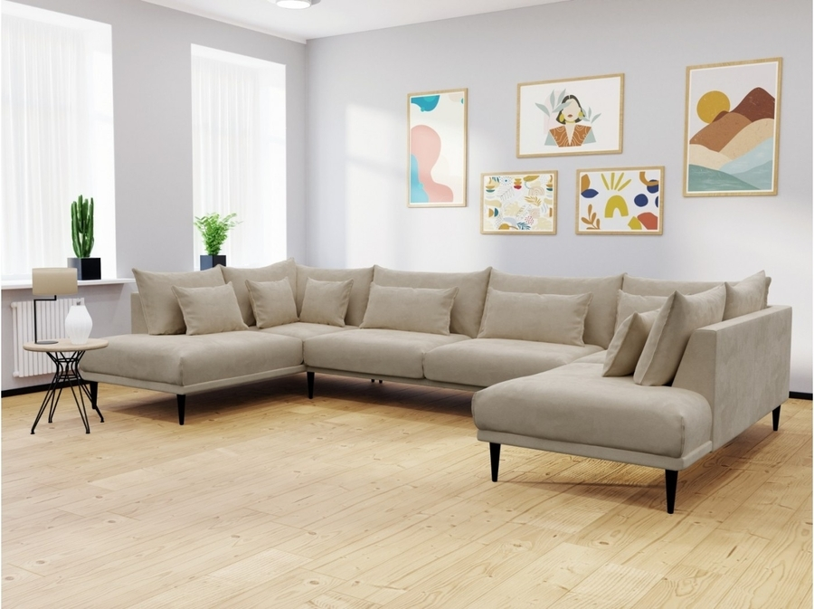

# Assignment-29
This Assignment is about image proccessing operators using opencv python

## How to install 
Run following command
```
pip install -r requirements.txt
```

## How to run

Inside each folder execute this command in terminal 
```
python main.py
```

## Result
> ### Face Morphing
#### Morph one face into another using OpenCV
 


> ### Black Hole
#### Using image processing and numpy in FIRST IMAGE OF A BLACK HOLE


> ### Photo to Sketch
#### Convert photo to sketch mode


> ### Discover Secret
#### Find the secret text

> ##### Secret is :


> ### Background Estimation
#### Make an image of empty road, without cars.


> ### Virtual Decorate
#### New floor design



